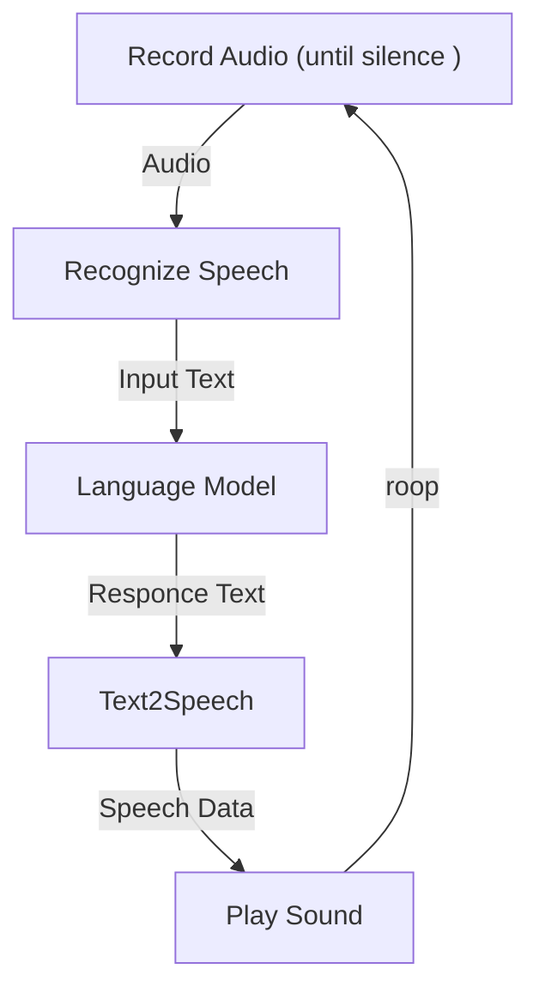

# 重要: VRChatで使用する場合は、Botと会話をするユーザーに対して会話データの収集の同意を得る必要があります。
詳細や同意を得るための方法については [`vrchat_take_agreement.md`](/vrchat_take_agreement.md)を参照願います。

# VRChat Bot

VRChatに対話型 AIシステムを実装するためのリポジトリです。


# インストール
## 環境  
- Windows 10 64bit
- Python 3.9  
- Miniforge3 https://github.com/conda-forge/miniforge
- NVIDIA GeForce RTX Graphics card
- CMake https://cmake.org/download/

## 仮想オーディオインターフェースをインストール  
VB Cableなどを用いるとVRChat上にマイクを接続する行為を簡単にすることができます。  
https://vb-audio.com/Cable/

## コマンド

依存関係をインストールします。
```sh
pip3 install torch torchvision torchaudio --extra-index-url https://download.pytorch.org/whl/cu117

pip install git+https://github.com/openai/whisper.git@main
```

このリポジトリをクローンし、プロジェクトのルートフォルダで次のコマンドを実行してください。

```sh
pip install .
```

# 使い方  

## OpenAIのAPI KEY 取得
[OpenAIのAPIKEYをここから取得してください](https://beta.openai.com/account/api-keys)  
取得したAPI KEYは `data/API_KEY.txt` を作成しその中に書き込んでください。  


## オーディオデバイスの確認  
次のコマンドを実行して、利用するスピーカとマイクを探します。    

```sh
python -m vrchatbot audio-devices
```

* output  
```
--- Microphones ---
Index: 0, Name: CABLE Output (VB-Audio Virtual Cable)
Index: 1, Name: ヘッドホン (Oculus Virtual Audio Device)

--- Speakers ---
Index: 0, Name: Name: CABLE Input (VB-Audio Virtual Cable)
Index: 1, Name: ヘッドホン (Oculus Virtual Audio Device)
```

使用するマイクとスピーカの名前を[`botconfig.toml`](/botconfig.toml)の中の `mic_index_or_name`および`speaker_index_or_name`にしてしてください。Indexによる指定も可能ですが、よくその値は変更されるため名前による指定が望ましいです。  

VRChatに実装する場合は、 マイクにループバックとしてスピーカーの名前を指定し、スピーカーに`CABLE Input (VB-Audio Virtual Cable)`といった仮想オーディオインターフェースを指定すると良いでしょう。そしてVRChat上のマイクに`CABLE Output (VB-Audio Virtual Cable)`などを指定することによって他のプレイヤーと対話できるようになります。  


## 実行  
それでは実行してみましょう!  
```sh
python -m vrchatbot run
```

* output   
```
Setting up...
Ready.
Recongnized: <話した声>

Responce: <AIのレスポンス>

...
```

### テキストチャットのみのモード  
音声認識を使用せずに、テキストチャットのみも使用できます。  

```sh
python -m vrchatbot chat
```  

* output

```
Setting up...
Ready.
人間: こんばんわ
人工知能:   「こんばんわにゃあ」
人間: <入力待ち>  
...
```  


### 文字起こしのみのモード
言語処理を行わず、音声認識モデルのみを使用することもできます。  

```sh
python -m vrchatbot recognize 
```

* output

```
Setting up...
Ready.
ja: 文字認識は始まっています。
ja: このようにして文字を認識できます。
...
```

# 仕様詳細  
このVRChat Botシステムを使用する際の詳細について以下に示します。 

## 全体の制御フロー  
次のようなシーケンシャルな処理を行っています。この構造によって、再度音声認識が行われるタイミングはBotが話し終えてからとなります。  





## 起動コマンド・オプション  
`python -m vrchatbot <command> --option` という形式を用いて指定します。  

### コマンド  
- *audio-devices*  
    使用可能なスピーカーおよびマイクの名前を表示します。マイクの一覧にはループバックデバイスとしてスピーカーも表示されます。
- *run*  
    Botを起動します。 音声認識、対話、音声合成を行います。  
- *chat*  
    テキストチャットのみのモードです。Botの受け答えを確認したい場合に用います。  
- *recognize*  
    音声認識のみのモードです。音声が適切に認識されるかどうかを確認したい場合に用います。  

### オプション  
- `-c`, `--config_file_path`  
    `botconfig.toml`といった設定ファイルまでのパスを指定することができます。  
    デフォルトではこのリポジトリ内の[`botconfig.toml`](/botconfig.toml)を読み込みます。  
- `--logdir`    
    会話データや文字起こしをした結果を保存する場所です。デフォルトではこのリポジトリ内の[`data/logs`](/data/logs/)に保存されます。    

## 設定ファイルについて  
botconfig.tomlの代表的な設定項目について記述します。クラスの引数に対応している場合はその引数名に対応させる形で新たに追加することができます。   

- Note: **デフォルトの`botconfig.toml`を複製して使用することを推奨します。**  仕様変更に伴ってリモートリポジトリに上書きされる恐れがあるためです。  

### Recorder   
このレコーダークラスは一定上の音量を検知すると録音をはじめ、行って時間無音を検知すると録音を終了します。  

この設定項目は[recorder.pyのRecorderクラスの引数に対応しています。](/vrchatbot/recorder.py)
- mic_index_or_name  
    マイクの名前またはインデックスを指定します。これをコメントアウトするとデフォルトのマイクデバイスを使用します。  
- buffer_size  
    一度に録音する音声のサンプルサイズです。  
- silence_duration_for_stop  
    このRecorderは一定時間の無音を検知すると録音を終了し、文字起こし処理に移ります。  
    その際の無音の長さを秒数で指定します。  
- volume_threshold  
    無音と判別する際のボリューム値です。この値以下の音量は無音と判別されます。  
    最大値は1.0, 最小値は0.0です。  

- max_recording_duration  
    一度に録音する最大の長さです。秒数で指定します。Whisperで一度に認識可能な最大の長さは30秒です。    

### SpeechRecognition

この設定項目は[speech_recognition.pyのSpeechRecongitionクラスの引数に対応しています。](/vrchatbot/speech_recongnition.py)  
- model_name  
    `base`や`large`といった音声認識モデル Whisperのモデルを選択します。選択可能な項目はWhisperのドキュメントを参照願います。 
    https://github.com/openai/whisper#available-models-and-languages   

- device  
    音声認識モデルを実行するローカルデバイスを指定します。  

### DecodingOption  
`whisper.DecodingOptions`の引数です。設定可能な項目はWhisperのドキュメントを参照願います。    
https://github.com/openai/whisper/blob/main/whisper/decoding.py#L72

### ChatBot  
OpenAI GPTのAPIと連携をとります。詳細はOpenAI GPTの公式ドキュメントを参照願います。https://beta.openai.com/docs/guides/completion  
この設定項目は[chatbot.pyのChatBotクラスの引数に対応しています。](/vrchatbot/chatbot.py)    
- api_key_file_path  
    API Keyを保存するファイルまでのパスです。  
- max_tokens  
    Chat Botのレスポンスの最大トークン数です。  
- free_tokens_for_user  
    ChatBotユーザーの入力テキストの最大トークン数です。  
- max_receptive_tokens  
    全ての会話履歴を合わせて、一度に処理可能な最大のトークン数です。 OpenAI のテキストエンジンによってこの最大数は変化します。  
    https://beta.openai.com/docs/models/overview

- behaviour_prompt  
    ChatBotの振る舞いを決定します。サンプルの設定ファイルを参考にしてください。  

- human_name  
    対話システム中の仮の人間の名前です。behaviour_promptの人間の名前と一致させてください。
- ai_name  
    対話システム中の仮の人工知能の名前です。behaviour_promptの人工知能の名前と一致させてください。

- stop  
    GPTの生成を止める停止ワードです。  
    これを正しく指定することによってGPTが人工知能側だけの会話文書を生成できるようになります。  

### Speaker  
この設定項目は[text_speaker.pyのTextSpeakerクラスの引数に対応しています。](/vrchatbot/text_speaker.py)    
- speaker_index_or_name  
    スピーカーの名前またはインデックスを指定します。これをコメントアウトするとデフォルトのデバイスを使用します。  